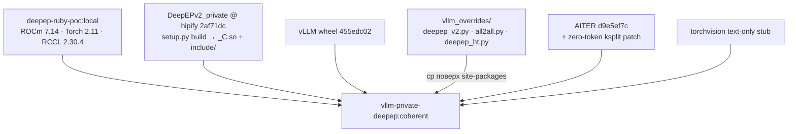
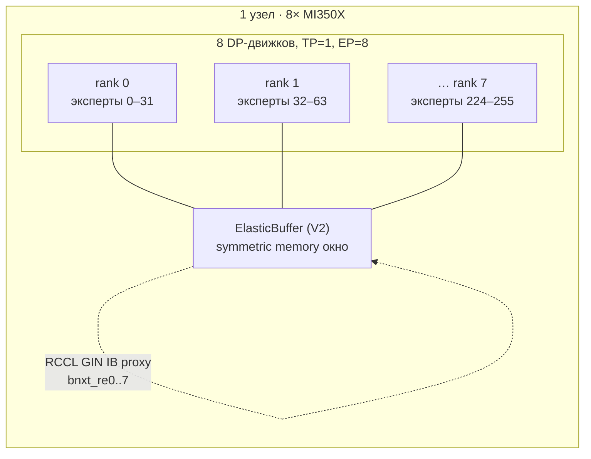
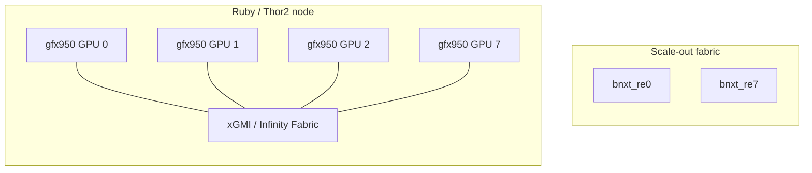
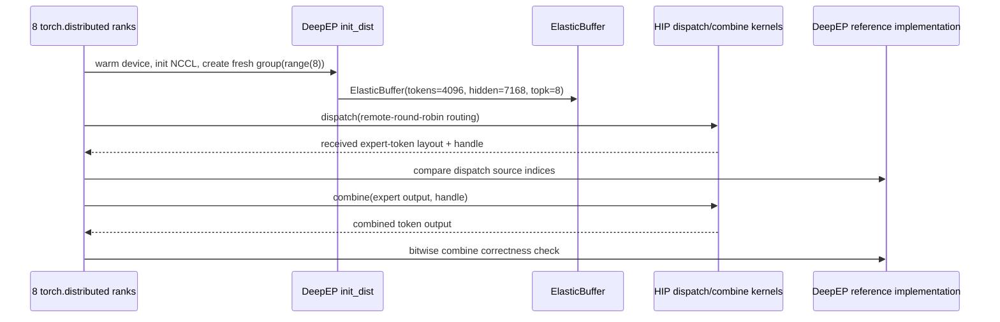
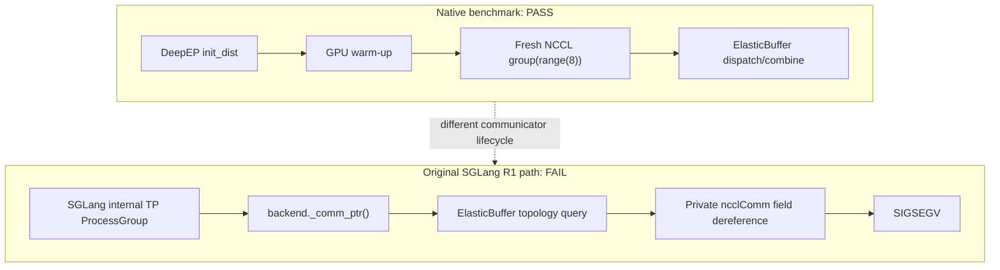
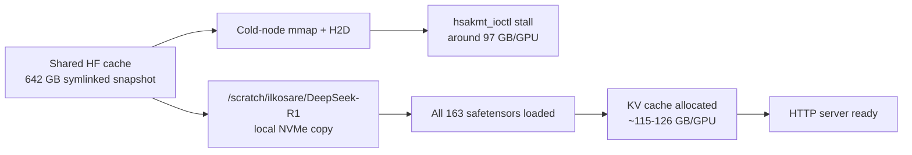
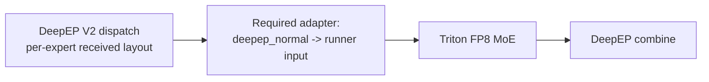
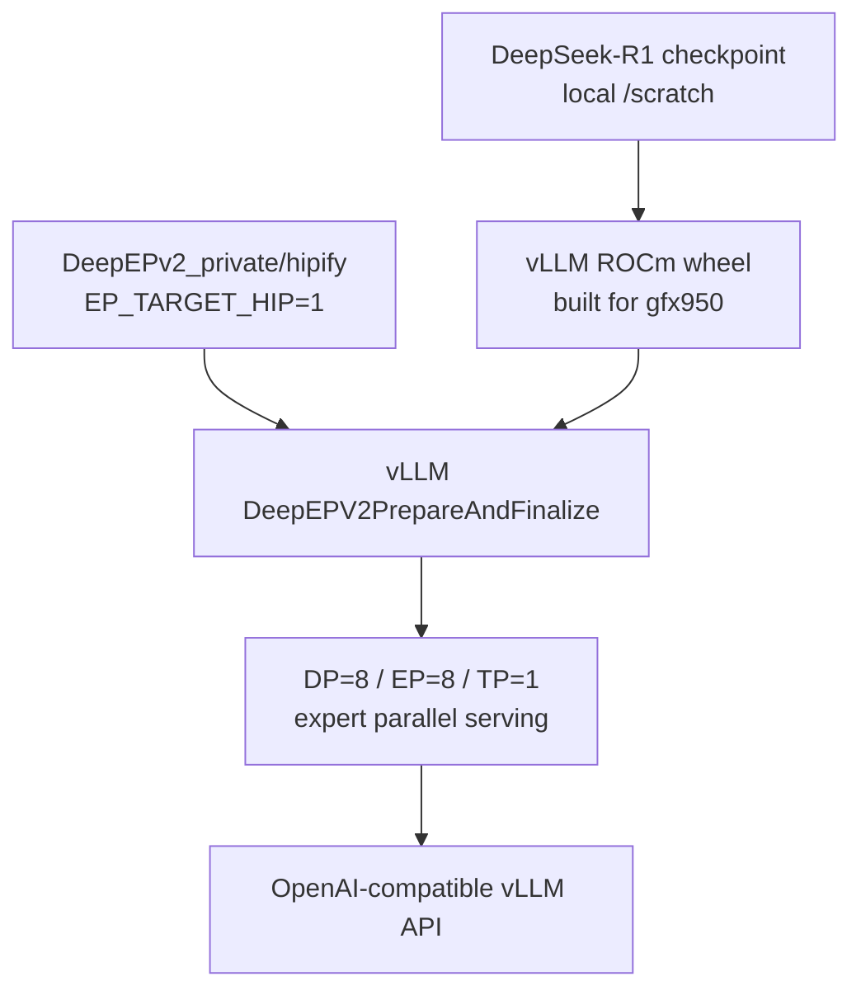
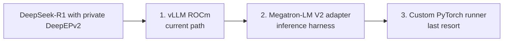

# DeepEPv2 on Ruby/Thor2: Benchmarks and DeepSeek-R1 Serving Experience

Date: 2026-08-18
Hardware: Ruby/Thor2, 8 × gfx950 / MI350X, Broadcom `bnxt_re` RoCE NICs





## Executive summary

The native DeepEPv2 1×8 ElasticBuffer benchmark is correct and fast on Ruby.
DeepSeek-R1 model initialization also works on the same hardware after staging
the checkpoint locally. The remaining R1 blocker in the SGLang path is not
model loading or RCCL initialization: it is an incomplete HIP FP8
`deepep_normal -> triton` adapter in SGLang.

The current first alternative is vLLM built with the mandatory private
`AMD-ROCm-Internal/DeepEPv2_private` repository, `hipify` branch. Its
DeepEPV2 modular MoE adapter already implements the per-expert layout that is
missing from SGLang.

## Hardware and base runtime



Primary validated THERock stack:

| Layer | Version / selection |
|---|---|
| Torch | 2.11.0, HIP 7.14.60850 |
| RCCL | `d22b8646`, overlaid into Torch’s bundled `librccl.so` |
| DeepEP | HIP build, ElasticBuffer V2 |
| GPU target | `gfx950` |
| RDMA userspace | rdma-core v61 in native DeepEP image |
| Model checkpoint | DeepSeek-R1, 163 safetensors, ~642 GB |

The RCCL binary used by Torch and DeepEP was checked by SHA-256 and matched.

## 1×8 native DeepEPv2 benchmark

The benchmark is not a synthetic NCCL all-reduce. It directly creates
`deep_ep.ElasticBuffer`, dispatches routed tokens, combines the expert outputs,
and checks both phases against DeepEP reference implementations.



Configuration:

| Parameter | Value |
|---|---:|
| EP ranks | 8 |
| Tokens per rank | 4096 |
| Hidden dimension | 7168 |
| Top-k | 8 |
| Experts | 256 |
| Data type | BF16 |
| Warmup / timed iterations | 50 / 50 |

Results:

| Backend | Correctness | Dispatch GB/s | Combine GB/s |
|---|---|---:|---:|
| DeepEPv2 | PASS on all 8 ranks | 186.271 | 87.307 |
| MoRI reference | PASS on all 8 ranks | 253.100 | 293.660 |

The MoRI result is a functional reference, not a fair performance winner:
DeepEP used THERock ROCm 7.14 / Torch 2.11, while the usable MoRI reference
used a separate SGLang ROCm 7.2 / Torch 2.9 image.

## Why the benchmark works but initial R1 serving did not



The SGLang adapter lazily constructs ElasticBuffer during the first MoE
forward. The original DeepEP HIP code passed PyTorch’s private communicator
pointer into a topology query that read RCCL implementation fields
(`ncclTeamWorld`, `ncclTeamLsa`). On this Torch 2.11 ProcessGroup, the pointer
was null or incompatible for that use.

The following focused fixes advanced execution:

1. `EP_FORCE_RDMA_RANKS=1`, `EP_FORCE_NVL_RANKS=8` bypasses private topology
   field reads for the 1×8 topology only.
2. DeepEP rejects a null `_comm_ptr()` and creates a managed communicator.
3. `SGLANG_DEEPEP_PRECREATE_COMM=1` creates that communicator before model/KV
   allocation, avoiding late CUMEM bootstrap allocation under memory pressure.
4. `SGLANG_DEEPEP_NUM_MAX_DISPATCH_TOKENS_PER_RANK=256` preserves the explicit
   bounded capacity instead of replacing it with worker fallback 16384.
5. `SGLANG_SCHEDULER_SKIP_ALL_GATHER=1` avoids SGLang’s unnecessary single-node
   CPU all-gather path.

With these changes, ElasticBuffer successfully created its 30 MB GPU buffer,
created d22 NCCL device communicators, and started DeepEP dispatch on all
ranks.

## DeepSeek-R1 model startup lessons



Loading directly from the shared HF cache stalled on cold Ruby nodes in
`hsakmt_ioctl` during FP8 weight copy. `SGLANG_DISABLE_ASYNC_WEIGHT_LOADING=1`
alone was insufficient on cold nodes.

Staging the resolved 642 GB snapshot to local `/scratch` at roughly 800 MB/s
eliminated this issue. With `/model` mounted from local NVMe, R1 consistently:

- loaded all 163 shards;
- allocated the KV cache;
- started its HTTP service.

## Final SGLang blocker

After ElasticBuffer construction, SGLang’s HIP FP8 DeepEP normal path reaches
the local expert compute stage:



The current SGLang branch has no registered
`deepep_normal -> triton` pre-permute/post-permute implementation:

```text
AssertionError: Pre-permute function for deepep_normal to triton is not registered
```

The standard Triton permutation cannot be used as a substitute. DeepEP normal
dispatch has a per-expert receive layout, invalid expert slots, scatter
indices, and combine metadata. Forcing standard Triton routing triggers a
DeepEP HIP duplicate-expert assertion and an HSA hardware exception.

An AITER adapter does exist, but its gfx950 runtime JIT module (`module_moe_asm`)
segfaulted in this stack. This is why SGLang R1 did not generate a token even
though its model and communication initialization advanced much further.

## Private DeepEPv2 repository

Required source:

```text
https://github.com/AMD-ROCm-Internal/DeepEPv2_private
branch: hipify
commit: 2af71dcd129afe7aa1d5a3c10a869e79771563b6
```

Important observations:

- `main` README is CUDA-first, but `hipify` contains an actual HIP path:
  `EP_TARGET_HIP`, RCCL roots, hipcc/amdclang and `PYTORCH_ROCM_ARCH`.
- The private HIPIFY source compiled and imported successfully on gfx950 /
  HIP 7.14.
- Its own ElasticBuffer test passed a first 8-rank case on Ruby:

```text
Ranks: 1 x 8
Experts: 8 / 256
Tokens: 256 (max: 256), hidden: 7168
QPs: 129 / 129
```

## Current path 1: vLLM + private DeepEPv2



vLLM differs materially from SGLang:

- it has `DeepEPV2PrepareAndFinalize`;
- it implements DeepEP V2 prefill layout (`do_expand=True`,
  `do_cpu_sync=True`);
- it turns received per-expert counts into `ExpertTokensMetadata`;
- it has matching dispatch and combine logic in its modular MoE implementation.

The private DeepEPv2 HIPIFY package passed its native smoke test. A persistent
`vllm-private-deepep:local` image was then built on c07 with:

- private HIPIFY DeepEPv2;
- locally built ROCm vLLM wheel;
- `PYTHONPATH=/opt/rocm/share/amd_smi` so vLLM detects ROCm GPUs;
- broken torchvision removed for text-only R1.

The next vLLM launch uses:

```text
--tensor-parallel-size 1
--data-parallel-size 8
--data-parallel-size-local 8
--enable-expert-parallel
--all2all-backend deepep_high_throughput
--enforce-eager
--gpu-memory-utilization 0.70
```

This is the preferred non-SGLang path because it has an existing DeepEP V2
adapter rather than requiring an unsafe port of the missing SGLang adapter.

## Other non-SGLang directions



1. **vLLM ROCm + private HIPIFY DeepEPv2**
   Best first path: production-oriented API and existing V2 prepare/finalize
   adapter.

2. **Megatron-LM + V2 adapter**
   Useful for a distributed R1 generation harness and correctness reference.
   It is not a turnkey HTTP serving path; it needs a DeepSeek checkpoint
   loader plus FP8/grouped-MoE execution configuration.

3. **Custom PyTorch runner**
   Maximum control but maximum implementation work. It must recreate
   per-expert scatter/grouped FP8 GEMM/inverse-scatter/combine semantics.
   This is only justified if both vLLM and Megatron integration paths fail.

## Runtime controls used in serving experiments

```bash
export EP_TARGET_HIP=1
export EP_DISABLE_LEGACY=1
export EP_GIN_QUEUE_DEPTH=0
export NCCL_GIN_TYPE=2
export NCCL_CUMEM_ENABLE=1
export NCCL_IB_HCA=bnxt_re0:1,bnxt_re1:1,bnxt_re2:1,bnxt_re3:1,\
bnxt_re4:1,bnxt_re5:1,bnxt_re6:1,bnxt_re7:1
export NCCL_IB_GID_INDEX=3
export NCCL_SOCKET_IFNAME=fenic0
export GLOO_SOCKET_IFNAME=fenic0
export HSA_NO_SCRATCH_RECLAIM=1
```

`EP_GIN_QUEUE_DEPTH=0` is intentional: RCCL GIN IB proxy requires its backend
default rather than a caller-provided queue depth.

## Current status

| Item | Status |
|---|---|
| Native private HIPIFY DeepEPv2 1×8 smoke | PASS |
| R1 local checkpoint staging | PASS |
| SGLang R1 model loading | PASS |
| SGLang ElasticBuffer/Gin initialization | PASS after targeted fixes |
| SGLang R1 token generation | BLOCKED by missing HIP FP8 adapter |
| vLLM ROCm wheel + private DeepEPv2 image | BUILT |
| vLLM R1 DeepEP serving request | Next execution step |
