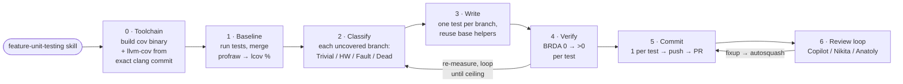
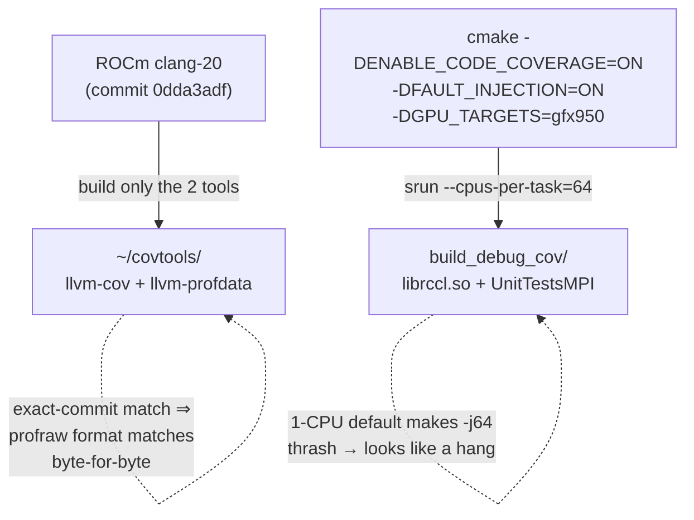
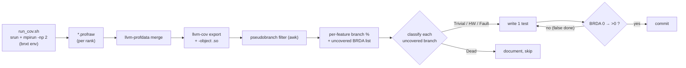
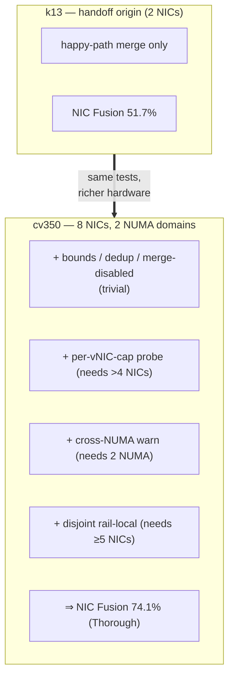
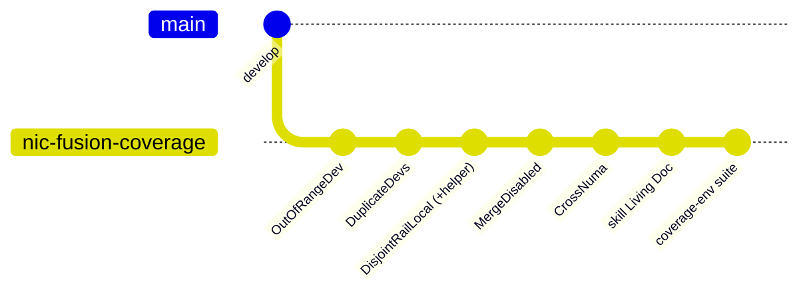
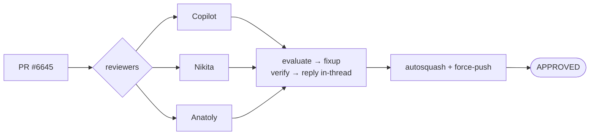
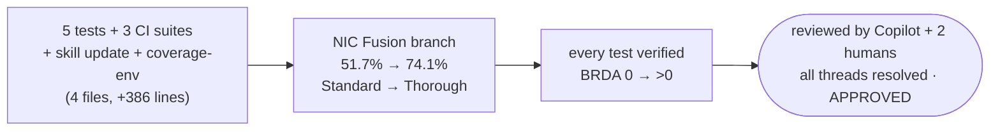

# Demo: Building PR #6645 with the `feature-unit-testing` skill

**PR:** ROCm/rocm-systems #6645 — *net-ib: add NIC Fusion error-path/topology tests*
**Branch:** `users/ilkosare/nic-fusion-error-path-coverage`
**Result:** 5 new tests + 3 CI suites, NIC Fusion branch coverage **51.7% → 74.1%** (Standard → Thorough)

---

## 1. The goal

Raise **branch** coverage of the RCCL `net_ib` NIC-Fusion feature
(`ncclIbMakeVDeviceInternal` / `ncclIbCheckVProps`). The existing suite only tested the
happy path (merge devices 0+1) — every validation, error, and topology-mismatch branch was cold.

Everything was driven by the repo-local skill **`.claude/skills/feature-unit-testing`**, whose
core discipline is: **measure first → classify the gap → one test per branch → re-measure to
prove each test moved its target. Never guess.**

---

## 2. The pipeline the skill enforces

---

## 3. Step 0 — the hard part: a working coverage toolchain

The cluster (`cv350`, ROCm 7.0.2, gfx950, 8× bnxt_re NICs) shipped **no** `llvm-cov`/`llvm-profdata`.

> **Gotcha (now in the skill):** `llvm-cov export` must pass `-object build_debug_cov/librccl.so.1.0`
> — net_ib/CAST live in the shared lib, not the test binary; without it they read as 0% covered.

---

## 4. The measure → classify → test loop

**The 6 NIC-Fusion branches and how each was handled:**

| Uncovered branch                       | Class       | Test                               | Reachable because… |
|----------------------------------------|-------------|------------------------------------|--------------------|
| device index ≥ count                   | Trivial     | `MakeVirtualDeviceOutOfRangeDev`   | any HW |
| dedup `continue` (same dev twice)      | Trivial     | `MakeVirtualDeviceDuplicateDevs`   | any HW |
| merge-disabled guard                   | Trivial+env | `MakeVirtualDeviceMergeDisabled`   | `NCCL_IB_MERGE_NICS=0` |
| cross-NUMA warn                        | Hardware    | `MakeVirtualDeviceCrossNuma`       | **8 NICs / 2 NUMA** |
| rail-local mismatch + ndevs-swap       | HW+env      | `DisjointMergeRailLocal_VNic`      | **≥5 NICs** + `WARN_RAIL_LOCAL=1` |
| per-vNIC cap (>4 devs)                 | Dead        | *(dropped)*                        | unreachable via public ABI (OOB) |

> The **BRDA re-check** caught two false "done"s: rail-local needed `WARN_RAIL_LOCAL=1`
> (default 0 → `&&` short-circuits); a cross-PCIe-root test passed but moved nothing → dropped.

---

## 5. What the hardware unlocked (the cv350 advantage)

4 of the 5 tests are only *reachable* on this multi-NIC node — exactly the
"ceiling is hardware-dependent" thesis the skill documents.

---

## 6. Commit hygiene + the review loop

Review feedback never adds new commits — it's `fixup` + `--autosquash` + force-push-with-lease,
so history stays **1 commit per test**.

**The catches that mattered:**

| Reviewer | Catch | Fix |
|----------|-------|-----|
| **Copilot** | `ExceedsMaxDevs` writes `devs[4]` — OOB (array size 4) | dropped; branch unreachable via public ABI |
| **Copilot** | LD_PRELOAD shim recipe inapplicable on RCCL (dlopen/dlsym private) | corrected the skill guidance |
| **Nikita**  | `MergeDisabled` always GTEST_SKIPs in CI | added `net_ib_merge_disabled` suite (`MERGE_NICS=0`) |
| **Anatoly** | asserts before `MPI_Send` → **peer deadlock** | `MPI_Allreduce` the skip/done flags before handshake |
| **Anatoly** | device count is the *merged* count (grows with vNICs) | `GetPhysicalDeviceCount()` = distinct `vProps.devs[0]` |
| **Anatoly** | a 1-device vNIC also reports `ndevs==1` | count distinct underlying indices, not `ndevs<=1` |

Anatoly's three catches were real correctness bugs (two deadlocks + a flaky device count),
not style — surfaced because the tests run 2-rank over MPI.

---

## 7. Findings folded back into the skill (Living Document)

The skill is a living artifact; each iteration appends **cluster-agnostic** lessons:

- LD_PRELOAD only intercepts PLT calls — useless when the target `dlopen`/`dlsym`s its deps or
  dispatches through a driver ops-struct (`cq->context->ops.poll_cq`); use a compile-time hook.
- `--cpus-per-task` or the coverage build silently thrashes.
- `llvm-cov export` needs `-object <the .so>`.
- BRDA re-check is not optional — it catches tests that pass but cover nothing.

Concrete %/cluster numbers were deliberately **kept out** of the skill — only the transferable
rule stays; the numbers live in the PR.

---

## 8. Net result

