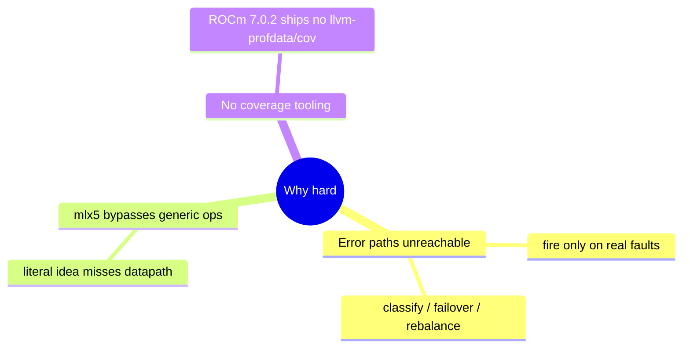
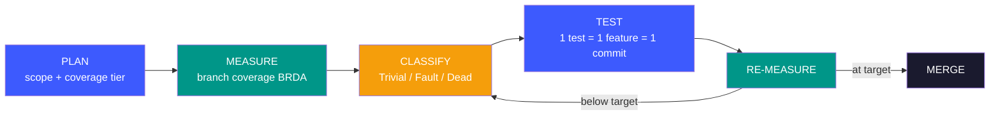
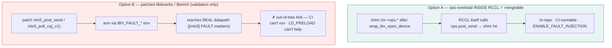
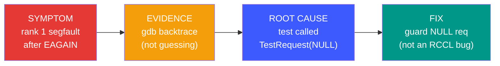
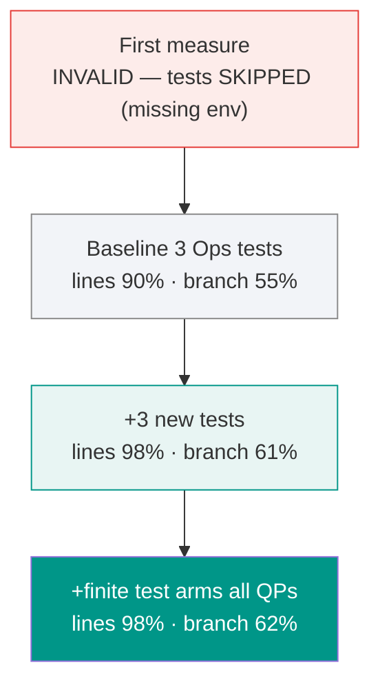
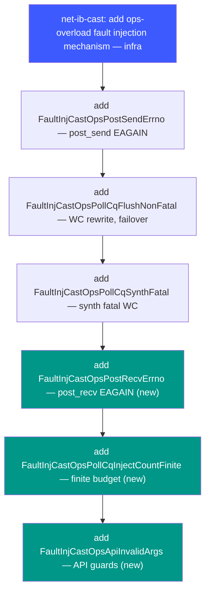

# IB-level Fault Injection for RCCL net-ib (CAST)
### A skill-driven development walkthrough

`feature-unit-testing` + `systematic-debugging` + coverage-gated TDD
RCCL · MI300x / Mellanox CX-7 RoCE · branch `users/ilkosare/ib-ops-fault-injection`

---

## 1. The task

Ticket idea: overload the `ibv_context_ops` returned by `ibv_open_device` so the
verbs datapath returns errors on demand — then verify RCCL's multi-QP resiliency
layer reacts correctly (fatal vs recoverable, QP failover, WRR rebalancing).

Why it isn't trivial:



---

## 2. The skill set the process

`feature-unit-testing` imposes **measure first, plan second** — and gates merge
on branch coverage, not line coverage.



**Two rules that changed outcomes**

| Rule | Why it mattered here |
|------|----------------------|
| **Branch coverage, not line** | A line runs once and looks "covered" while its error arm never executes. We gated on per-branch BRDA counts. |
| **Verify the test actually RAN** | `RUN_EXIT:0` includes `GTEST_SKIP`. Our first coverage run looked green but every CAST test had silently skipped on a missing env var. |
| **Classify before testing** | Dead branches don't count toward the ceiling — don't write tests that yield +0 delta. |

---

## 3. Two implementations explored

The literal ticket idea (overload at `ibv_open_device`) never entered the mlx5
datapath — so the work split into two paths.



| | Option A | Option B |
|---|----------|----------|
| Injection point | `ctx->ops.*` (in RCCL) | `mlx5_*` symbols (patched provider) |
| Control | `ncclIbCastFaultOps*` API | `IBV_FAULT_*` env |
| In repo / CI | **yes** | no (external fork) |
| Role | **the mergeable deliverable** | documented validation harness |

---

## 4. systematic-debugging in action

Option-B's PostSend test crashed (signal 11). The skill's **Iron Law: no fix
without root-cause evidence first.**



```
backtrace (rank 1)
#0  IbCastTest (request=0x0)        p2p.cc:1054   ← NULL deref
#1  TestRequest (request=0x0)       NetIbMPITestBase.hpp:288
#2  LibibverbsFault_PostSendErrno   LibibverbsFaultTests.cpp:131  ← the test
```

**Finding:** an unscoped fault blocked the receiver's CTS → `sendReq` stayed
NULL → the test dereferenced it. The mechanism was fine; the harness wasn't.

---

## 5. Coverage-gated iteration

Measure → classify → add tests → re-measure (`net_ib_ops_fault.cc`).



| Phase | Lines | Branches | What moved it |
|-------|-------|----------|---------------|
| First measure | — | — | **INVALID**: tests SKIPPED (missing env) |
| Baseline (3 Ops tests) | 132/146 · 90% | 52/95 · 55% | valid measurement |
| +3 new tests | 143/146 · 98% | 58/95 · 61% | recv-fault, finite-count, invalid-args |
| +finite arms all QPs | 143/146 · 98% | 59/95 · 62% | rewrite-decrement branch |

**Result:** 6 Ops tests, all PASS — **98% line / 62% branch**. The remaining 36
branches were audited one-by-one: every one is a defensive guard unreachable
through a real connection (the public API validates first). That is the honest
path-A ceiling — not a test gap.
→ *Next: a fake-`ibv_context` unit harness to drive those guards directly (planned).*

---

## 6. Shipped (Path A) — one test = one commit



Rebased on develop (+270 commits), one CMake conflict resolved, pushed with
`--force-with-lease`. **No Co-Authored-By.** Path B + the MPI env workaround stay
local (out-of-tree / not mergeable). Verified before push: build + all 6 tests PASS.

---

## 7. What the skill bought us

- **Discipline over guessing** — measure branch coverage before writing a single test; classify every gap before deciding to test it.
- **Caught two false-greens** — `GTEST_SKIP` hiding behind exit 0; line coverage hiding untested error arms.
- **Root cause, not symptom** — a gdb backtrace turned a "RCCL crash" into a one-line test fix, with no wasted fixes.
- **Honest ceiling** — 62% branch is the real path-A limit; the rest is documented defensive code, not debt.
- **Clean, reviewable history** — one test = one commit; mechanism vs tests separated; out-of-tree work kept out.
- 