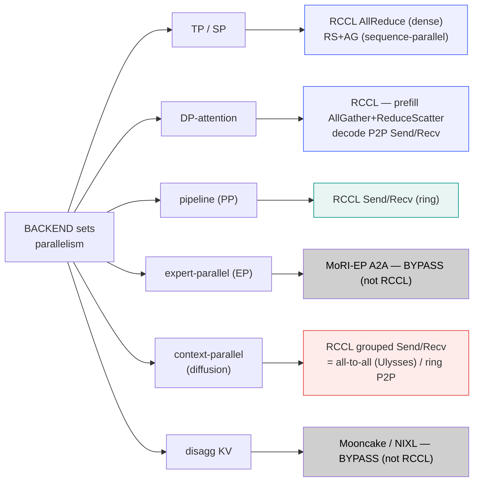
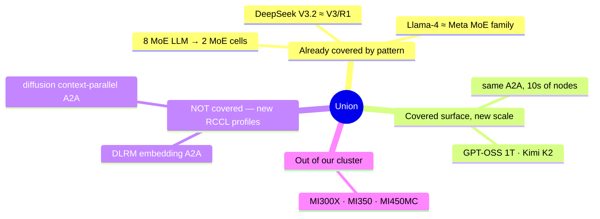
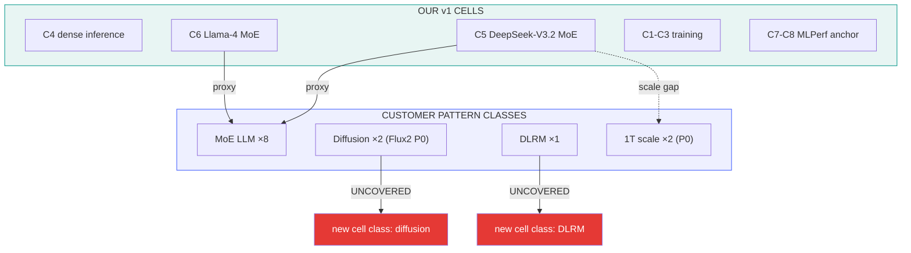
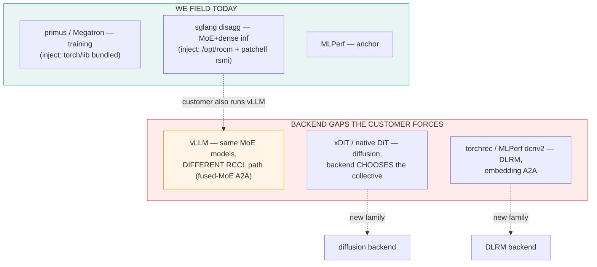
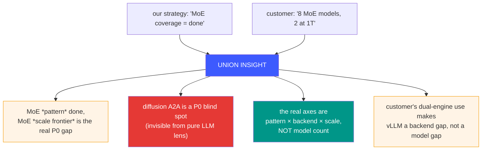
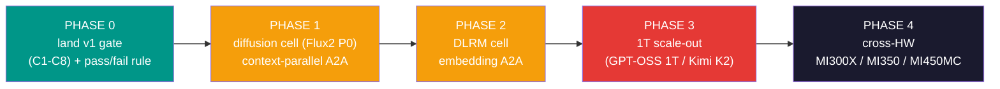
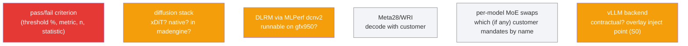

# Unified Launch Architecture
### Our release-gate strategy × the customer workload request

How the validation stack we designed (`arch-our-strategy.md`) absorbs the
customer's 12-model ask (`arch-customer-models.md`) into one matrix — and what
the union exposes that neither view shows alone.

---

## 0. The full layered stack (HW → fabric → comm libs → framework → backend → model)

Read bottom-up. The decisive structural fact this exposes: **layer 3 is not just
RCCL** — three independent communication libraries share the same AINIC fabric,
and only one of them (RCCL) is the unit under test. The backend (layer 5) is what
chooses the parallelism, and *that* choice decides which collective lands on which
library. Coverage is therefore a property of the **backend × parallelism**, not of
the model name.

```mermaid
flowchart TB
    subgraph L6["LAYER 6 · MODEL — the workload"]
        direction LR
        m1["dense LLM<br/>Llama-3.1 8B/70B"]
        m2["MoE LLM<br/>DeepSeek V3.2/R1 · Llama-4<br/>Qwen3 · Kimi K2 · GPT-OSS"]
        m3["diffusion DiT<br/>Flux2 · Wan2.2"]
        m4["recommender<br/>DLRM"]
    end
    subgraph L5["LAYER 5 · BACKEND — chooses parallelism + RCCL inject point"]
        direction LR
        b1["primus / Megatron-LM<br/>TP·PP·SP·FSDP"]
        b2["sglang disagg xPyD<br/>TP·EP·DP-attn"]
        b3["vLLM<br/>TP·EP"]
        b4["xDiT<br/>context-parallel"]
        b5["torchrec / MLPerf dcnv2<br/>embedding-sharded"]
    end
    subgraph L4["LAYER 4 · FRAMEWORK"]
        f1["PyTorch · torch.distributed · ROCm 7.2 (HIP)"]
    end
    subgraph L3["LAYER 3 · COMM LIBRARIES — three parallel paths, one fabric"]
        direction LR
        c1["RCCL — librccl ⭐ UNIT UNDER TEST (overlay B vs C)<br/>AllReduce · AllGather · ReduceScatter · Send/Recv"]
        c2["MoRI-EP — mori<br/>expert A2A · GPU-init RDMA<br/>BYPASS"]
        c3["Mooncake / NIXL<br/>disagg KV transfer<br/>BYPASS"]
    end
    subgraph L2["LAYER 2 · FABRIC + SCHEDULER"]
        direction LR
        t1["XGMI<br/>intra-node P2P"]
        t2["AINIC Pollara RoCE<br/>rdma0-7 · ionic · GDRDMA<br/>inter-node"]
        t3["SLURM<br/>amd-tw / rccl_dev"]
    end
    subgraph L1["LAYER 1 · HARDWARE"]
        h1["MI355X · gfx950 · 8 GPU / node"]
    end
    L6 --> L5 --> L4 --> L3 --> L2 --> L1

    style L6 fill:#3d5afe,color:#fff
    style L5 fill:#5e35b1,color:#fff
    style L4 fill:#00897b,color:#fff
    style L3 fill:#e53935,color:#fff
    style L2 fill:#f59e0b,color:#fff
    style L1 fill:#1a1a2e,color:#fff
    style c1 fill:#fff,stroke:#e53935,stroke-width:3px,color:#000
    style c2 fill:#cfcfcf,color:#000
    style c3 fill:#cfcfcf,color:#000
```



**Routing — how the backend's parallelism choice picks the library + collective**
(the RCCL legs are evidence-based, measured from `NCCL_DEBUG=INFO`):



> **Read-out:** RCCL has **no AllToAll primitive** — torch `all_to_all_single`
> lowers to *grouped Send/Recv*, so the diffusion CP leg (R5) and a pipeline leg
> (R3) look alike by op-name and differ only by *pattern* (full mesh vs ring).
> The expert A2A (R4) and KV (R6) never touch librccl. This is why "MoE A2A
> coverage" was a mislabel and why diffusion/DLRM are the only cells that add a
> genuine all-to-all *pattern*.

---

## 1. The intersection (the proxy insight)



The decisive fact: **our 2 MoE inference cells are the RCCL-proxy for 8 of the
12 customer models.** RCCL does not distinguish "DeepSeek" from "Qwen" — it sees
the same collective fingerprint (prefill AllGather+ReduceScatter under DP-attention,
decode P2P Send/Recv; AllReduce secondary; expert A2A bypasses to MoRI). So
coverage is about **pattern classes and scale points**, not enumerating every model.

---

## 2. Coverage overlay — our cells vs customer demand



---

## 2b. The backend axis — the multiplier both views share

Neither the customer list nor our cell matrix is one-dimensional in "models."
The hidden second dimension is **backend**: the same model on a different backend
is a different RCCL codepath *and* a different overlay injection point. The union
makes this sharp because the customer runs **both inference engines** while our
v1 gate currently fields **only sglang** on the inference side.



The coverage equation is **models × backends × scale**, not models alone:

| Axis | Covered in v1 | Customer-forced gap |
|------|---------------|---------------------|
| training backend | primus | — |
| inference backend (LLM) | **sglang only** | **vLLM** = same models, fused-MoE A2A + distinct TP allreduce sequence |
| diffusion backend | none | xDiT/native — **CP strategy picks A2A (Ulysses) vs P2P (ring)** |
| DLRM backend | none | torchrec / MLPerf dcnv2 — embedding A2A |

> vLLM is the cleanest illustration that **backend is coverage, not redundancy**:
> it adds zero new *models* over our sglang cells, yet exercises a genuinely
> different RCCL integration for those same models.

---

## 2c. The concrete cell matrix (v1 baseline + customer-driven)

`C1–C8` = our v1 release-gate cells. `C9–C19` = cells the customer's 12-model
list forces on top; customer priority is in parentheses next to the cell name.

> **Critical correction (evidence over architecture).** Verified from
> `NCCL_DEBUG=INFO` on the multinode DeepSeek-V3.2 runs (`tp=16 dp=2 ep=16
> moe_a2a_backend=mori enable_dp_attention=True`):
> - The MoE expert-parallel All-to-All runs through **MoRI-EP** (GPU-initiated
>   RDMA over AINIC), **not RCCL** — same category as Mooncake KV.
> - The MoE cells are **not** "TP-AllReduce primary". The measured RCCL
>   fingerprint is phase-split: **prefill = AllGather + ReduceScatter dominant**
>   (DP-attention; ~56k AG / 28k RS vs ~3k AllReduce), **decode = P2P Send/Recv
>   dominant** (millions of ncclSend/ncclRecv) + ReduceScatter; AllReduce is real
>   but a distant third. RS/AG coverage exists **only** with `dp_size>1`.
> - **RCCL has no AllToAll primitive**: torch `all_to_all_single` lowers to
>   *grouped ncclSend/ncclRecv*, so genuine A2A (diffusion xDiT Ulysses, DLRM
>   torchrec) shows up in logs as Send/Recv — distinguishable from pipeline/decode
>   P2P only by *pattern* (full mesh vs ring), not op-name.
>
> Coverage below is what **librccl actually executed** (grep the op inventory from
> `NCCL_DEBUG=INFO`), not what the architecture implies.

```
+-----+-----------------------------------------+------------------+-------------------------------------------------------+-------------------------------------------------------+
| #   | Cell / model                            | Backend          | RCCL coverage (measured / expected)                   | Notes / variants                                      |
+-----+-----------------------------------------+------------------+-------------------------------------------------------+-------------------------------------------------------+
| C1  | primus Llama-3.1 8B training            | primus-megatron  | P1 AllReduce BW-bound; TP-SP RS+AG (small-msg)        | -                                                     |
| C2  | primus Llama-3.1 70B training +PP=4     | primus-megatron  | + P6 pipeline P2P (send/recv)                         | -                                                     |
| C3  | primus Llama-3.1 70B FSDP (conditional) | primus-megatron  | + RS+AG large-msg (param-sharding)                    | only if --use-pytorch-fsdp flag                       |
| C4  | Llama-3.1 8B inference disagg 1P+1D     | sglang           | dense: TP AllReduce (prefill BW + decode LL)          | traffic={uniform,realistic}, ctx={short 1k, long 32k} |
| C5  | DeepSeek-V3.2 disagg 1P+1D              | sglang           | prefill AG+RS (DP-attn) + decode P2P; A2A=MoRI        | traffic={uniform,realistic}, ctx={short,long}         |
| C6  | Llama-4 Scout disagg 1P+1D              | sglang           | prefill AG+RS (DP-attn) + decode P2P; A2A=MoRI        | traffic={uniform,realistic}, ctx={short,long}         |
| C7  | MLPerf training Llama-3.1-8B            | mlperf-harness   | external anchor: comparable to public AMD submissions | 100 steps capped                                      |
| C8  | MLPerf inference Llama2-70B-99          | mlperf-harness   | external anchor (inference side)                      | per-harness                                           |
| C9  | DeepSeek R1 disagg 1P+1D (P0)           | sglang           | same as C5 (AG+RS + P2P); MLA attn != NSA             | proxy-ish; attn differs from V3.2                     |
| C10 | GPT-OSS 120B disagg (P0)                | vLLM             | TP AllReduce + EP A2A -- VERIFY RCCL or DeepEP        | NEW BACKEND (vLLM); decide via NCCL_DEBUG             |
| C11 | GPT-OSS 120B training (P0)              | primus-megatron  | training AllReduce + RS+AG (expert grads via RCCL)    | customer wants train path                             |
| C12 | Qwen3-Next 80B disagg (P0)              | sglang           | same as C5 (AG+RS + decode P2P)                       | proxy / model-swap; low marginal RCCL                 |
| C13 | Kimi K2 Thinking (~1T) disagg (P0)      | sglang           | AG+RS + P2P at SCALE; A2A=MoRI                        | NEW SCALE point (scale = AG/RS+P2P, not A2A)          |
| C14 | Flux2 image diffusion (P0)              | xDiT             | GENUINE A2A (grouped Send/Recv): CP Ulysses/ring      | NEW PATTERN + BACKEND; verify mesh shape              |
| C15 | Meta28/WRI (P0)                         | ? (decode)       | UNKNOWN - needs decode with customer                  | q4 blocker                                            |
| C16 | DeepSeek V3 disagg (P1)                 | sglang           | same as C5 (AG+RS + decode P2P)                       | proxy / model-swap                                    |
| C17 | Llama-4 / Meta MoE disagg (P1)          | sglang           | same as C6 (AG+RS + decode P2P)                       | proxy / model-swap; Meta MoE is MI450MC HW            |
| C18 | Wan2.2 14B video diffusion (P1)         | xDiT             | GENUINE A2A (grouped Send/Recv): video long seq       | NEW PATTERN (after C14)                               |
| C19 | Meta DLRM (P1)                          | torchrec / dcnv2 | GENUINE A2A (grouped Send/Recv): embedding ragged     | NEW PATTERN + BACKEND; real A2A coverage              |
+-----+-----------------------------------------+------------------+-------------------------------------------------------+-------------------------------------------------------+
```

> **C9, C12, C16, C17 are proxies** — same RCCL surface as C5/C6 (TP AllReduce +
> RS/AG; expert A2A bypasses RCCL via MoRI), so they're model-swaps with low
> marginal RCCL value (run only if contractually named). The cells that buy
> *new* coverage are **C10** (new backend — RCCL A2A only if it doesn't use
> DeepEP, verify), **C13** (RCCL at 1T *scale* — but the scaled collective is
> AllReduce/RS-AG, not A2A), **C14/C18** (genuine RCCL A2A via diffusion Ulysses),
> **C19** (genuine RCCL A2A via DLRM embedding). **C11** is an MoE *training* cell
> that v1 deliberately excluded — included only because the customer's
> known-backend mapping pulls it in.

### RCCL-axis coverage after this matrix

```
+---------------------------------------------+----------+---------------------------------------------+
| RCCL axis / pattern                         | Status   | Covered by                                  |
+---------------------------------------------+----------+---------------------------------------------+
| AllReduce Ring BW-bound (training/prefill)  | yes      | C1, C2, C11; minor in C5/C6 prefill         |
| AllReduce LL/LL64 latency-bound (decode)    | yes      | C4 (dense); MINOR in MoE decode (=P2P+RS)   |
| AllGather + RS (DP-attn) -- sglang DOMINANT | yes      | C5, C6, C9, C12, C16, C17 prefill (dp>1)    |
| RS+AG small-msg (TP-SP training)            | yes      | C1, C2                                      |
| RS+AG large-msg (FSDP params)               | cond.    | C3 (if flag)                                |
| AG/RS + P2P at 1T scale (10s of nodes)      | GAP      | C13 (the real RCCL scale gap)               |
| P2P Send/Recv -- HEAVY in sglang decode     | yes      | C2 (PP=4); C5/C6/C9.. MoE decode (millions) |
| Irregular / ragged collectives (P5)         | yes      | C4-C6 realistic traffic                     |
| Long-message latency (long-context)         | yes      | C4-C6 long ctx                              |
| All-to-All = grouped Send/Recv (no a2a op)  | GAP(new) | C14/C18 (Ulysses), C19 (DLRM); shape != PP  |
| Diffusion ring-attention P2P (CP alt)       | GAP(new) | C14 / C18 (backend CP choice)               |
| External calibration (MLPerf)               | yes      | C7, C8                                      |
| Broadcast                                   | incid.   | startup only - no dedicated cell            |
| -- BYPASS (NOT RCCL) ---------------------- | -------- | ----------------------------------          |
| MoE expert A2A (EP dispatch/combine)        | bypass   | C5/C6/C9/C12/C13/C16/C17 via MoRI-EP        |
| vLLM EP A2A (if DeepEP/pplx)                | verify   | C10 -- confirm via NCCL_DEBUG               |
| KV transport (Mooncake)                     | sep.KPI  | C4-C6 byproduct (RDMA, not RCCL)            |
+---------------------------------------------+----------+---------------------------------------------+
```

Legend: `yes` covered · `cond.` conditional · `GAP` uncovered (planned) ·
`GAP(new)` uncovered + new pattern · `bypass` runs but NOT through librccl ·
`verify` confirm from NCCL_DEBUG · `sep.KPI` separate non-RCCL metric ·
`incid.` incidental.

**The headline this exposes:** the gate built around MoE has strong RCCL
**AllReduce + RS/AG** coverage but **almost no genuine RCCL All-to-All** — the
A2A everyone assumed MoE provided is owned by MoRI. Real RCCL A2A only arrives
with the diffusion (C14/C18) and DLRM (C19) cells, which makes them the
highest-value *new* coverage, not just "extra patterns."

---

## 3. The unified matrix

```mermaid
flowchart LR
    subgraph T0["TIER 0 — have it"]
        u1["primus Llama 8B/70B +PP/FSDP"]
        u2["sglang DeepSeek-V3.2"]
        u3["sglang Llama-4 Scout"]
        u4["MLPerf train 8B / inf 70B"]
    end
    subgraph T1["TIER 1 — cheap adds (model swap on sglang)"]
        u5["GPT-OSS 120B"]
        u6["Qwen3-Next 80B"]
        u7["DeepSeek R1"]
    end
    subgraph T1b["TIER 1b — new BACKEND, same models"]
        ub["vLLM disagg: DeepSeek / Llama-4<br/>(fused-MoE A2A path)"]
    end
    subgraph T2["TIER 2 — new pattern class + new backend family"]
        u8["diffusion: Flux2 (P0) / Wan2.2<br/>(xDiT/native · Ulysses vs Ring)"]
        u9["DLRM (torchrec / MLPerf dcnv2)"]
    end
    subgraph T3["TIER 3 — new scale / new HW"]
        u10["1T: GPT-OSS 1T / Kimi K2"]
        u11["MI300X / MI350 / MI450MC"]
    end

    T0 --> T1 --> T1b --> T2 --> T3

    style T0 fill:#009688,color:#fff
    style T1 fill:#e8f5f3,stroke:#009688
    style T2 fill:#fff4e6,stroke:#f59e0b
    style T3 fill:#fdecea,stroke:#e53935
```



| Tier | What | Effort | RCCL value |
|------|------|--------|------------|
| **0** | existing gate cells (primus + sglang + MLPerf) | done / in-flight | the baseline coverage |
| **1** | swap model weights into the **same** sglang disagg cell | days each | low marginal (same A2A surface) — do only if customer insists on the specific model |
| **1b** | **vLLM** backend for models we already run on sglang | new overlay inject + bring-up, ~1-2 wks | **medium** — no new models, but a *different RCCL codepath* (fused-MoE A2A, distinct TP allreduce); customer runs both engines |
| **2** | **diffusion** (context-parallel A2A) + **DLRM** (embedding A2A) — new backend families | new stacks, weeks | **high** — genuinely new collective profiles, Flux2 is P0 |
| **3** | 1T-scale allocs + other-HW clusters | large infra | high but gated on resources |

---

## 4. What the union reveals (that neither view alone does)



---

## 5. Recommended phased rollout



Ordering rationale:
- **Phase 0 first** — without the pass/fail rule the gate isn't a gate. Cheapest, highest leverage.
- **Phase 1 (diffusion) before per-model MoE swaps** — Flux2 is P0 *and* a new RCCL profile; one diffusion cell buys more coverage than ten MoE model-swaps.
- **DLRM next** — P1, but MLPerf dcnv2 harness may make bring-up cheaper than diffusion.
- **Scale + HW last** — highest infra cost, gated on resources, partly out of current scope.

**Where the vLLM backend lands:** vLLM is a *backend-coverage* add, not a pattern
or scale add — it slots in **parallel to Phase 1/2** whenever the customer's dual-
engine requirement becomes contractual, reusing the sglang cells' models. It is
deliberately *not* on the critical path: a new RCCL codepath for known models is
lower marginal coverage than a new pattern class (diffusion/DLRM) or scale point
(1T). Sequence it by customer pull, not by RCCL value.

---

## 6. Decision points still open



| # | Decision | Blocks |
|---|----------|--------|
| q1 | formal pass/fail rule | turning the matrix into an actual gate |
| q2 | diffusion serving stack choice (which backend → which collective) | Phase 1 (P0 Flux2) |
| q3 | DLRM harness feasibility on gfx950 (torchrec vs MLPerf dcnv2) | Phase 2 |
| q4 | what Meta28/WRI is | a P0 item we can't classify |
| q5 | which named MoE models are contractually required | Tier-1 effort sizing |
| q6 | is vLLM contractually required, and its overlay inject point (torch/lib vs ROCm system — verify at S0) | Tier-1b effort sizing |

---

## 7. One-line synthesis

> Our gate already **proxies 8 of 12 customer models** through 2 MoE cells; the
> real gaps the customer surfaces are **not more models** but **two new
> all-to-all profiles** (diffusion — P0, DLRM) and **the 1T scale frontier**
> (two P0 models). Prioritise pattern classes and scale points over model count.
> 