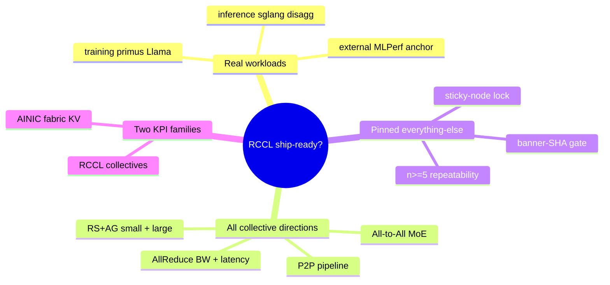
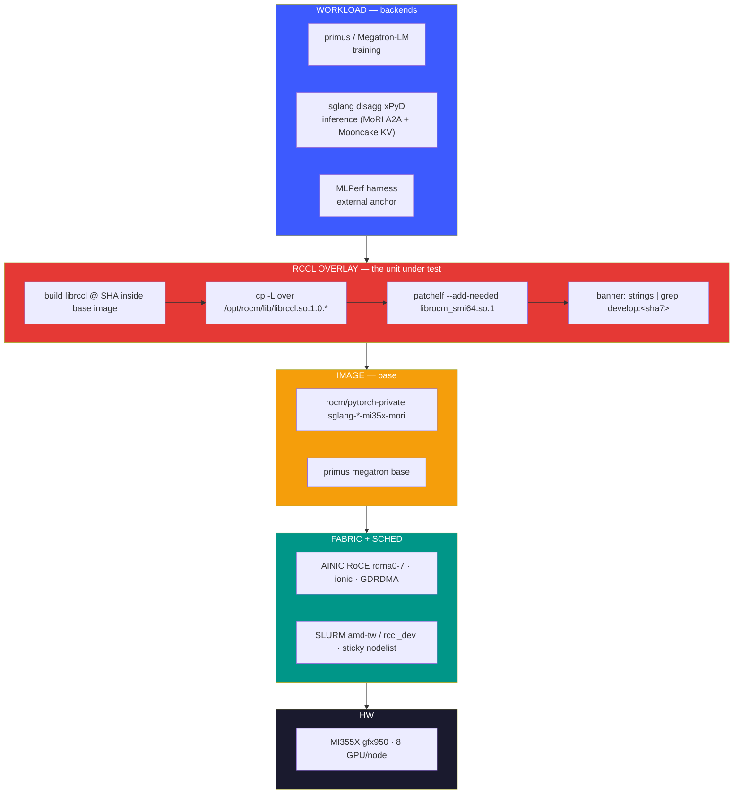
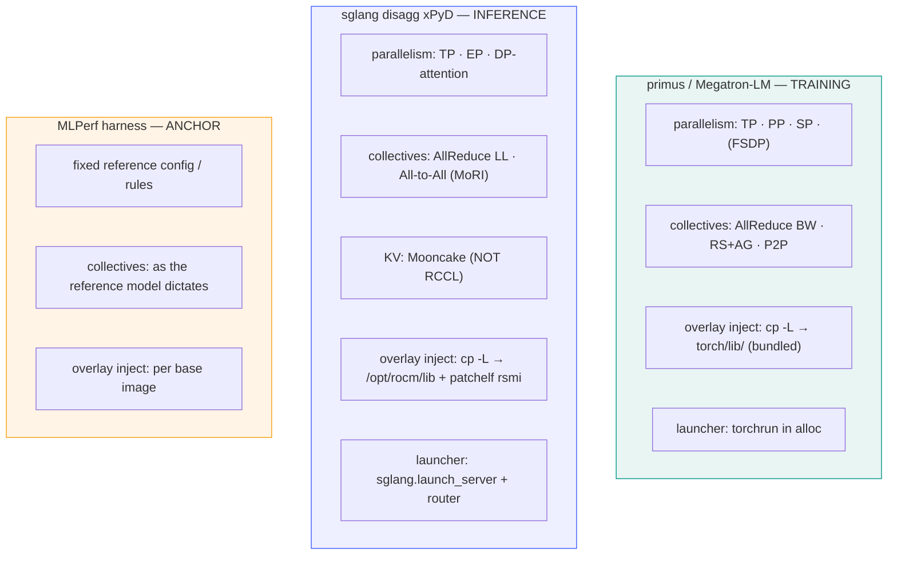
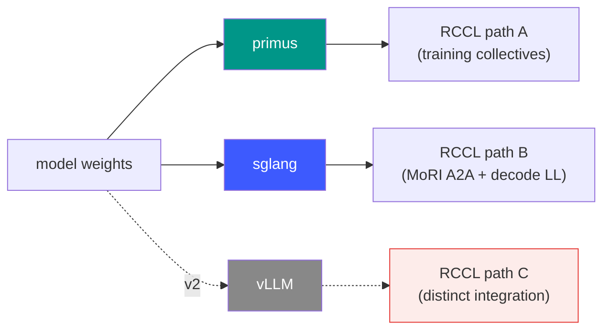
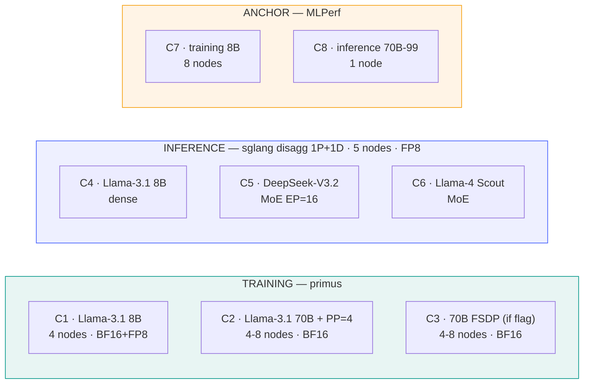
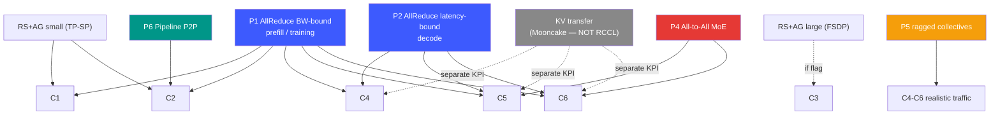
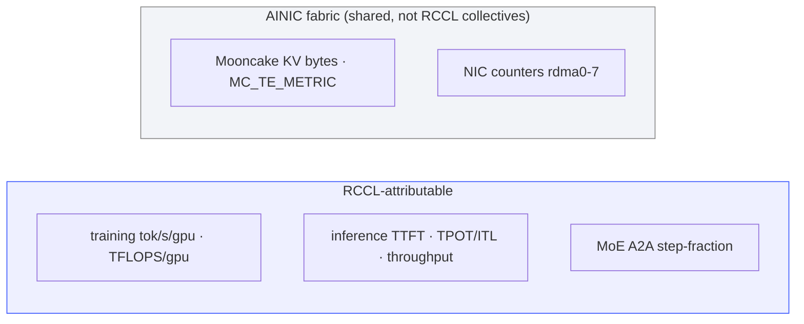
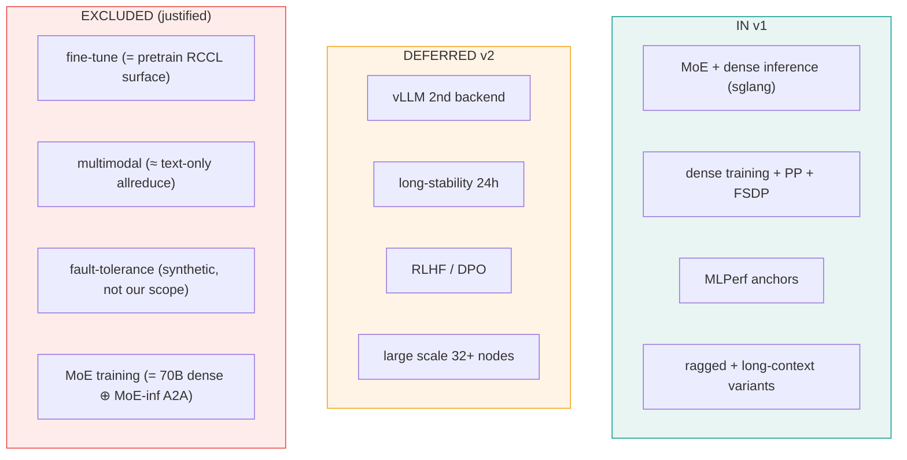

# RCCL Release-Gate — Launch Architecture (Our Strategy)
### The v1 validation stack we designed

Posture: **release-gate** — answer "is this RCCL artifact ship-ready?" on
customer-representative AI workloads.
Cluster: mia1 · gfx950 / MI355X · AMD AINIC Pollara RoCE (rdma0–7) · SLURM `amd-tw` / `rccl_dev`

---

## 1. What this validates



The thesis: a single A/B (RCCL build C vs baseline B) with **everything but
librccl pinned**, run across enough cells that every collective "direction" a
customer exercises is lit up by *some* real model.

---

## 2. The stack (layered)



The RCCL overlay (L4) is the *only* thing that changes between build B and C.
Every other layer is byte-identical — that is what makes the delta attributable.

---

## 2b. Backends — the RCCL integration axis (first-class)

The backend is **not** a detail of the workload layer — it is its own coverage
axis. The *same model* drives RCCL differently per backend because each has its
own torch.distributed integration, its own collective call sequence, and its own
**overlay injection point**. A regression can hit one backend's RCCL path and
miss another's.



**Why the injection point differs per backend** (the load-bearing detail):

| Backend | torch librccl resolution | Inject target | Extra step |
|---------|--------------------------|---------------|------------|
| primus | torch DT_RPATH `$ORIGIN` → bundled `torch/lib/librccl.so` | `…/torch/lib/` | — |
| sglang | `ctypes.find_library("rccl")` → `/opt/rocm/lib/librccl.so.1.0.*` | ROCm system lib | `patchelf --add-needed librocm_smi64.so.1` (else `import torch` dies on `rsmi_init`) |
| vLLM (v2) | TBD — verify at S0 (may be either) | banner-gate decides | TBD |

> The overlay recipe is **per backend**, not universal. Reusing primus's
> bundled-`torch/lib` recipe on sglang silently loads the stock RCCL (banner-gate
> catches it; the `rsmi_init` import-death catches the patchelf miss).



This is exactly why **vLLM is a deferred coverage gap, not a redundant model
list** — it is a *different RCCL codepath* for the same models.

---

## 3. The cell matrix (v1)



Inference cells carry two orthogonal axes:

| Axis | Values | Lights up |
|------|--------|-----------|
| `traffic` | `uniform` / `realistic` (sharegpt-dist) | deterministic baseline / **P5 ragged collectives** |
| `ctx` | `short` (1k/128) / `long` (32k/4k) | small-msg / **long-message latency** |

---

## 4. RCCL pattern coverage



---

## 5. Launch flow (one gate cycle)

```mermaid
flowchart LR
    B0["resolve pair<br/>B=last good · C=develop HEAD"] --> B1
    B1["build 2× overlay images<br/>(B,C) + build-time SHA assert"] --> B2
    B2["distribute to sticky nodes<br/>docker save | ssh load"] --> B3
    B3["acquire sticky-lock<br/>pinned nodelist"] --> B4
    B4["per cell: 1-iter/1-prompt SANITY"] -->|fail| STOP["abort cell"]
    B4 -->|pass| B5["banner-SHA gate<br/>grep NCCL INFO RCCL version"]
    B5 -->|mismatch| STOP
    B5 -->|match| B6["run n>=5 · phase-aware parse"]
    B6 --> B7["aggregate delta C vs B"]
    B7 -->|all |Δ| in noise| PASS["certify → C becomes next B"]
    B7 -->|regression| FILE["block + bisect → PR"]

    style B5 fill:#e53935,color:#fff
    style PASS fill:#009688,color:#fff
    style FILE fill:#f59e0b,color:#fff
    style STOP fill:#1a1a2e,color:#fff
```

---

## 6. Integrity gates (the 95% of the job)

| Gate | Failure it prevents | Source lesson |
|------|--------------------|----------------|
| **Banner-SHA** | overlay didn't load → A vs A, 0% "reproducible" | ca8ec1f fiasco |
| **patchelf librocm_smi64** | `import torch` dies `undefined symbol: rsmi_init` | sglang overlay |
| **Sticky-node lock** | different nodes → 1-2% topology swing masquerades as RCCL delta | cliff 4 |
| **1-iter/1-prompt sanity** | link breaks / MoRI OOM / graph-capture fail caught in 60s | cliffs 3,5 |
| **Phase-aware parse** | BF16+FP8 in one perf.csv → last-write wins, silent data loss | primus BF16 trigger |
| **n≥5** | noise mistaken for signal (proven ±0.04-0.06% repeatable) | develop-vs-drop |

---

## 7. KPI layering



---

## 8. Scope boundary (v1)



**Open item before this becomes a true gate:** a formal pass/fail criterion
(threshold %, metric, n, statistic) — the matrix exists, the decision rule does not yet
